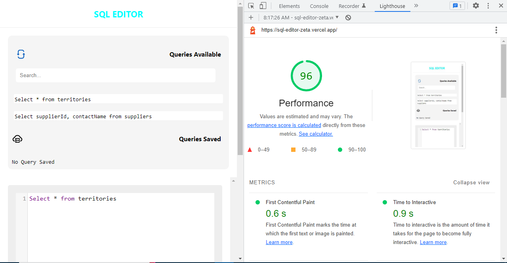
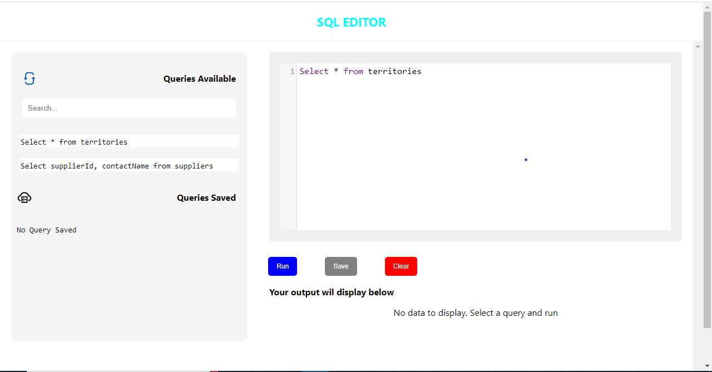
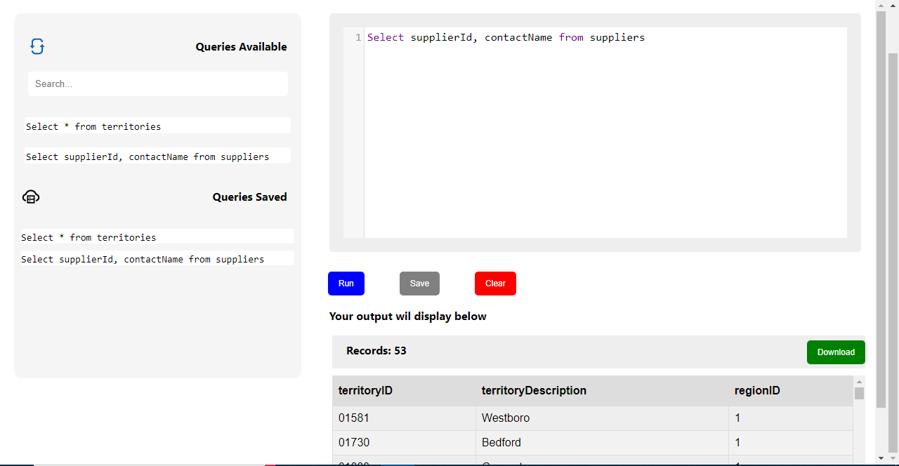

# Atlan: SQL Editor

## Overview

An application used for running / executing SQL queries online and analyzing the output based on the query inputted.

**Live Link**: [https://sql-editor-zeta.vercel.app](https://sql-editor-zeta.vercel.app)

## Tools Used

**Interface and Stylings**:

- React Js
- CSS
- React Icons
- React Spinkit (Loader)
- React Hot Toast (Notifications)
- Code mirror (Text Editor)

**Data**:

- React CSV
- [CSV Json](https://csvjson.com)

## Page Optimization and Speed

For optimization and speed, I used Google's Lighthouse tool to generate and analyze reports on the page load time.

### Load Time

Based on the report, the time taken for the page to become fully interactive is 0.9 seconds. This is an important aspect of the application to improve user experience.

- Lazy-Loading:
  I used lazy loading to reduce page weight and enhance load time
- Code Splitting:
  I made use of code splitting to make the code efficient and reduce bundle size of pages that can be loaded dynamically.
- Styling:
  I used CSS for the styling to reduce file size and enable faster loading time. this also helps to load the stylings of the application when the user has a bad / poor connection to improve user experience .
- Re-usable Components:
  I used this technique to improve code architecture.
- Responsiveness:
  I made sure the application is responsive for good user experience for mobile users.

## ScreenShot for Performance

## Screenshot for Functionality

